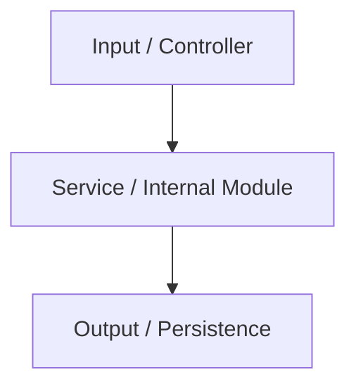

# 📂 Directory Documentation: `[Directory Name]`

## 🎯 Overview
* **Purpose:** `[Clear description of the architectural responsibility of the directory]`
* **Layer:** `[e.g., Domain / Infrastructure / Application]`

## 🏗️ Architecture and Data Flow

## 🗂️ Component Mapping
* `📄 main_file.py`: `[Description of file role]`
* `📄 utils.py`: `[Utility functions]`

## 🧠 Design Decisions & Trade-offs
* **Decision:** `[Technical choice description]`
* **Motivation:** `[Reason and discarded alternatives]`

## 🧪 Testing Strategy
* **Test Types:** `[Unit / Integration]`
* **Critical Scenarios:** `[Covered edge cases]`

## 🔗 Related Context
* Obsidian Vault: `[[relevant-note-name]]`
