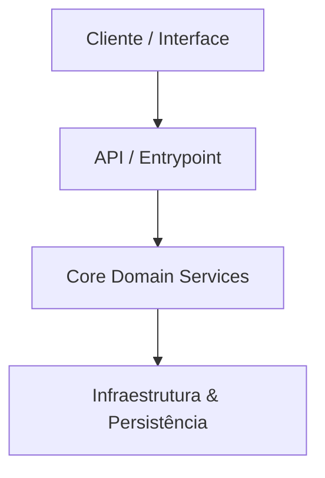

# 🚀 [Nome do Projeto]

> [!NOTE]
> **Visão de Negócio:** `[Uma frase concisa descrevendo o propósito do projeto, o problema que resolve e o público-alvo]`

---

## 🛠️ Stack Tecnológica

* **Core:** `[Linguagem / Framework principal]`
* **Banco de Dados / Persistência:** `[Tecnologia de storage ou ORM]`
* **Testes & Qualidade:** `[Framework de testes e linter]`
* **Arquitetura:** `[Padrão arquitetural ex: Hexagonal / Clean / Agentic Workflow]`

---

## 🏗️ Arquitetura em Alto Nível



---

## ⚡ Getting Started (Onboarding)

### Pré-requisitos
* `[Requisito 1 ex: Python 3.10+ / Node.js 18+]`
* `[Requisito 2 ex: Docker / Git]`

### Instalação & Setup Local

1. **Clonar o repositório:**
   ```bash
   git clone [url-do-repositorio]
   cd [nome-do-diretorio]
   ```

2. **Instalar dependências:**
   ```bash
   [comando real ex: npm install ou poetry install ou pip install -r requirements.txt]
   ```

3. **Executar a aplicação:**
   ```bash
   [comando real ex: npm run dev ou python main.py]
   ```

---

## 🧰 Comandos Úteis

```bash
# Executar suíte de testes
[comando de teste]

# Executar linters / formatadores
[comando de linter]
```

---

## 📄 Licença & Contribuição

`[Informações sobre contribuição e licença do projeto]`
