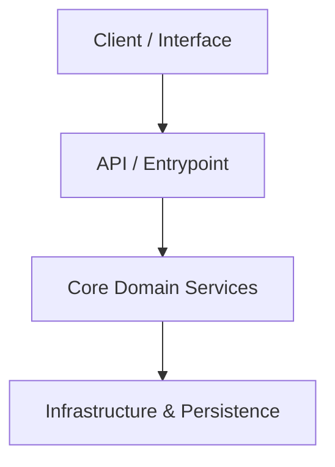

# [Project Name]

> [!NOTE]
> **Business Vision:** `[Concise sentence describing the project purpose, problem it solves, and target audience]`

---

## Tech Stack

* **Core:** `[Primary language / framework]`
* **Database / Persistence:** `[Storage technology or ORM]`
* **Testing & Quality:** `[Testing framework and linter]`
* **Architecture:** `[Architectural pattern e.g., Hexagonal / Clean / Agentic Workflow]`

---

## High-Level Architecture



---

## Getting Started (Onboarding)

### Prerequisites
* `[Prerequisite 1 e.g., Python 3.10+ / Node.js 18+]`
* `[Prerequisite 2 e.g., Docker / Git]`

### Local Installation & Setup

1. **Clone repository:**
   ```bash
   git clone [repository-url]
   cd [directory-name]
   ```

2. **Install dependencies:**
   ```bash
   [real command e.g., npm install or poetry install or pip install -r requirements.txt]
   ```

3. **Run application:**
   ```bash
   [real command e.g., npm run dev or python main.py]
   ```

---

## Useful Commands

```bash
# Run test suite
[test command]

# Run linters / formatters
[linter command]
```

---

## License & Contribution

`[Contribution and license information]`
