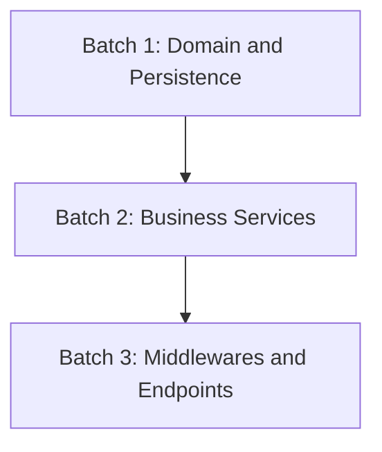

# TDD Implementation Plan (`implementation_plan.md`)

**Feature Slug:** `[FEATURE_SLUG]`
**Git Branch:** `[BRANCH_NAME]`
**Contracts Read:**
- BDD: `[[01-concepcao/bdd-[FEATURE_SLUG].md]]`
- SDD: `[[01-concepcao/sdd-[FEATURE_SLUG].md]]`

---

## 📐 1. Architecture and Batch Strategy

Succinctly describe the architectural approach adopted and how functionality was divided into Independent Contextual Units for context optimization.

---

## 🔗 2. Technical Dependency Graph

---

## 🎯 3. Context Batches Summary

| Batch | Domain / Responsibility | Affected Components | Risk |
| --- | --- | --- | --- |
| **Batch 1** | Base data structures and contracts | `src/domain/`, `src/repositories/` | Low |
| **Batch 2** | Business rules and orchestration | `src/services/` | Medium |