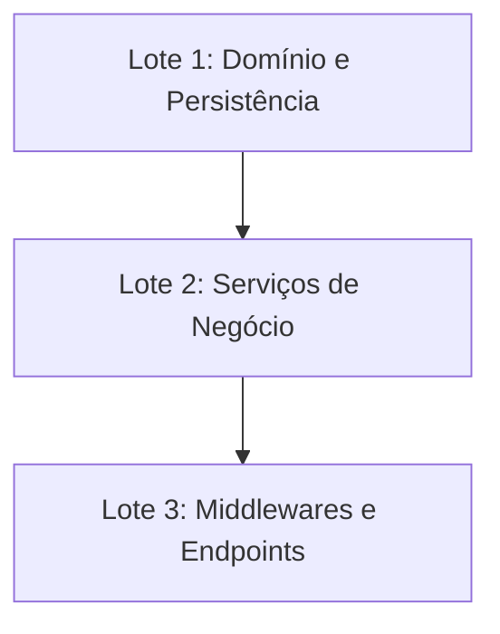

# Plano de Implementação TDD (`implementation_plan.md`)

**Feature Slug:** `[FEATURE_SLUG]`
**Branch Git:** `[BRANCH_NAME]`
**Contratos Lidos:**
- BDD: `[[01-concepcao/bdd-[FEATURE_SLUG].md]]`
- SDD: `[[01-concepcao/sdd-[FEATURE_SLUG].md]]`

---

## 📐 1. Arquitetura e Estratégia de Lotes

Descreva sucintamente a abordagem arquitetural adotada e como a funcionalidade foi dividida em Unidades Contextuais Independentes para otimização de contexto.

---

## 🔗 2. Grafo de Dependências Técnicas

---

## 🎯 3. Resumo dos Lotes Contextuais

| Lote | Domínio / Responsabilidade | Componentes Afetados | Risco |
| --- | --- | --- | --- |
| **Lote 1** | Estruturas base de dados e contratos | `src/domain/`, `src/repositories/` | Baixo |
| **Lote 2** | Regras de negócio e orquestração | `src/services/` | Médio |