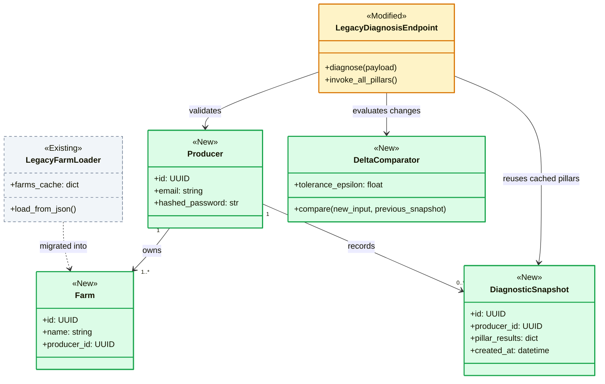
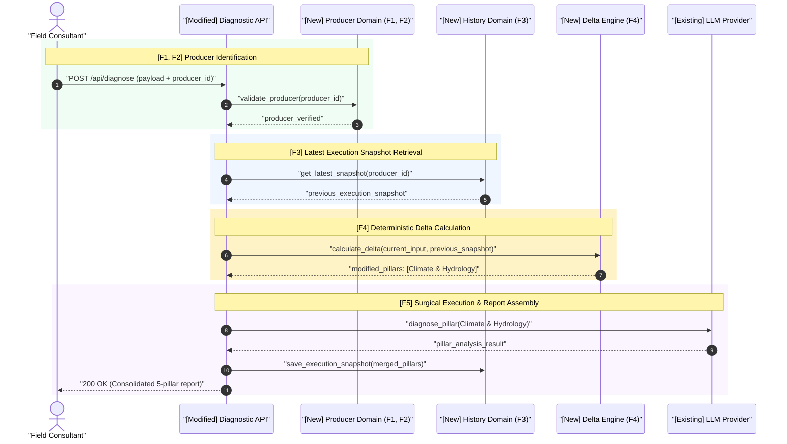
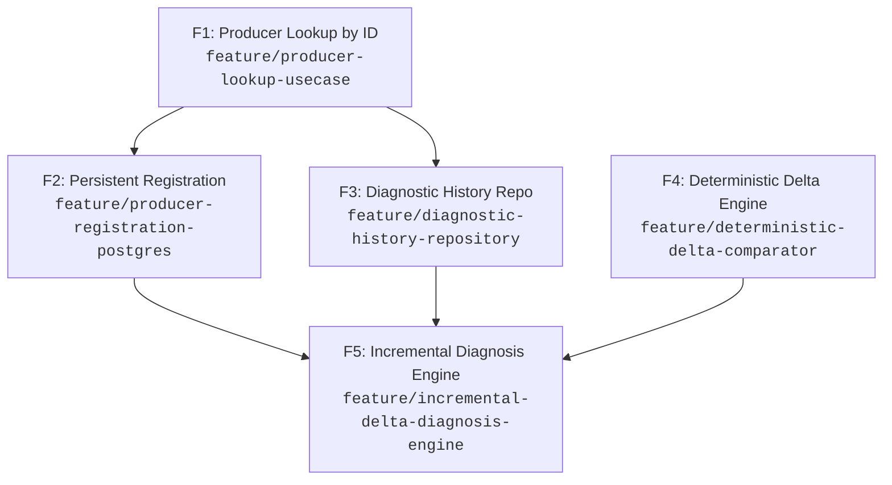

# Epic Blueprint: Producer Management & Incremental Delta Diagnosis Engine

## 1. Problem & Desired Observable Outcome

### Current State & Problem
Farm data is currently loaded from a monolithic static file (`farms.json`). Every diagnosis re-executes all 5 agronomic pillars through LLM prompts from scratch, incurring high token costs and an average response latency exceeding 18 seconds, even when a producer changes only a single parameter (e.g., recent rainfall).

### Affected Users or Systems
* Agronomists and Field Consultants (excessive UI waiting times).
* Diagnostic Backend Service and LLM API quotas (OpenAI / Anthropic).

### Desired Observable Outcome
Enable dynamic, relational persistence for producers and farms in PostgreSQL, and execute incremental diagnoses that query LLMs strictly for pillars impacted by producer updates, reusing historical snapshots for unchanged pillars.

### Epic Success Criteria

| ID | Verifiable Outcome | Validation Method |
|---|---|---|
| S1 | At least 60% reduction in LLM token consumption for follow-up diagnoses with modifications in $\le 2$ pillars. | Automated token consumption telemetry on delta test payloads. |
| S2 | P95 response latency under 4 seconds for incremental diagnoses with partial pillar reuse. | Automated latency benchmark in the integration test suite. |
| S3 | Zero LLM calls when an identical payload is submitted for an existing diagnosis. | Acceptance test with client spy verifying 0 LLM network invocations. |

---

## 2. Scope & Boundaries

### In-Scope
- Relational persistence of Producers and Farms in PostgreSQL.
- Producer registration endpoint with email uniqueness validation and password hashing.
- Execution history persistence for diagnostic inputs, benchmarks, and generated analyses.
- Deterministic payload delta comparator isolating modified pillars without LLM calls.
- Incremental diagnosis orchestrator invoking LLMs only for affected pillars and composing reports.

### Out-of-Scope (Non-Goals)
- Frontend web or mobile UI redesigns (restricted to domain APIs and engine logic).
- Bulk batch upload of farms via CSV/Excel spreadsheets.
- Modifications to underlying LLM prompt templates or model versions.

### Constraints
- Strict backward compatibility with existing JSON response contracts consumed by client applications.
- Cryptographic password hashing using Argon2/Bcrypt; credentials must never appear in plaintext or application logs.

---

## 3. Architectural Context & Decisions

### Relevant Existing State
- The legacy `farms.json` file is loaded synchronously at service startup.
- The legacy `POST /api/diagnose` endpoint accepts static payloads and executes LLM calls sequentially for all pillars.

### Structural Domain Delta (Class Diagram) [Mandatory]



### Macro Business Journey (Sequence Diagram) [Mandatory]



### Proposed High-Level Approach
Adopt Clean Architecture with Dependency Inversion (`IProducerRepository`, `IDiagnosticHistoryRepository`). Introduce a pure domain in-memory delta engine before LLM orchestration to enable deterministic semantic caching.

### Invariants to Preserve
- The final response payload must maintain 100% schema compatibility with the format expected by the frontend.

### References & ADRs
- `ADR-004: Dependency Inversion for Relational Repositories`
- `ADR-007: Pillar Caching and Delta Engine for Diagnostic LLMs`

---

## 4. Shared Boundary Contracts

| ID | Contract / Boundary | Relevant Guarantees | Introduced In | Consumed By |
|---|---|---|---|---|
| C1 | `IProducerRepository` | Lookup by ID and email; uniqueness persistence; returns typed DTO or `None`. | F1 | F2, F5 |
| C2 | `IDiagnosticHistoryRepository` | Persists snapshot per producer; retrieves latest valid execution; multi-tenant isolation. | F3 | F5 |
| C3 | `IDeltaComparator` | Identifies modified pillars with reasoning; purely deterministic (zero I/O). | F4 | F5 |

### Contract Validation Strategy
- **Test Doubles:** `InMemoryProducerRepository` and `InMemoryDiagnosticHistoryRepository` (Functional in-memory Fakes).
- **Fixtures & Isolation:** Deterministic seed fixtures reset per test via `pytest`.
- **Validation with Real Adapters:** Shared contract test suite executed against both the in-memory Fake and PostgreSQL via Testcontainers.
- **Evolution Policy:** Preserve signatures; extend capabilities by appending new methods without altering existing parameters.

---

## 5. Risks, Hypotheses & Pending Decisions

| ID | Risk / Hypothesis / Uncertainty | Impact | Mitigation / Validation Timing | Owner |
|---|---|---|---|---|
| R1 | False positive deltas: equivalent numerical values (e.g., minor float rounding) triggering unnecessary LLM calls. | Medium (cost) | Strict numerical normalization with epsilon threshold in F4. | Backend Lead |
| R2 | Partial LLM failures during a single modified pillar leaving history in an inconsistent state. | High | Atomic database transaction in F5: history updates only upon complete success of all pillars. | Tech Lead |

### Blocking Questions for Kickoff
- None. Database drivers, migration tools, and test environments are validated.

---

## 6. Roadmap & Dependency Graph

### Summary Table

| ID | Feature | Type | Observable Outcome | Depends On |
|---|---|---|---|---|
| F1 | Producer Lookup by ID | Vertical Slice | Functional lookup use case backed by seeded in-memory Fake. | — |
| F2 | Persistent Producer Registration | Vertical Slice | Producer registration with real PostgreSQL adapter and uniqueness constraint. | F1 |
| F3 | Diagnostic History Repository | Vertical Slice | Persistence and retrieval of diagnostic execution snapshots. | F1 |
| F4 | Deterministic Delta Comparator | Vertical Slice | Pure delta calculation across payloads identifying modified pillars. | — |
| F5 | Orchestrated Incremental Engine | Vertical Slice | End-to-end diagnosis integrating surgical LLM invocations and history. | F2, F3, F4 |

### Dependency Graph



---

## 7. Sub-Feature Specifications

### F1 — Producer Lookup by ID
- **Branch:** `feature/producer-lookup-usecase`
- **Type:** Vertical Slice
- **Status:** Ready
- **Objective:** Establish the executable producer lookup use case and `IProducerRepository` interface with an in-memory Fake seeded from `farms.json`.
- **Demonstrable Outcome:** Look up existing producers by ID and retrieve validated domain models without relying on static files hardcoded in presentation logic.
- **Contributes to:** S1, S2.

#### Scope
- Domain entities `Producer` and `Farm`.
- Interface `IProducerRepository`.
- Implementation `InMemoryProducerRepository` with legacy seed helper.
- Executable, tested use case `GetProducerByIdUseCase`.

#### Out of Scope
- PostgreSQL database tables (scope of F2).
- Producer creation and write operations.

#### Dependencies & Readiness
- **Requires:** None.
- **Ready to Start When:** Base branch `develop` is synchronized.

#### Contracts & Compatibility
- **Introduces:** C1 (`IProducerRepository`).
- **Consumes:** None.
- **Preserves:** Integrity of historical `farms.json` sample datasets.

#### Acceptance Criteria
- [ ] Given an ID present in the seed, lookup returns the populated `Producer` entity with associated farms.
- [ ] Given a non-existent ID, lookup returns `None` or raises typed `ProducerNotFoundException`.
- [ ] Implementation introduces zero regressions to legacy services.

#### Integration & Rollout
- **Integration:** Internal service wired via dependency injection.
- **Availability:** Internal application usage only.
- **Reversal:** Direct commit revert with zero database migration footprint.

#### Handover to `/plan`
- **Mandatory Context:** Leverage `farms.json` to construct deterministic test seed fixtures.

---

### F2 — Persistent Producer Registration
- **Branch:** `feature/producer-registration-postgres`
- **Type:** Vertical Slice
- **Status:** Planned
- **Objective:** Implement `POST /api/v1/producers` wired to a real PostgreSQL adapter, enforcing email uniqueness and password hashing.
- **Demonstrable Outcome:** Registered producers persist to PostgreSQL and remain queryable across application restarts.
- **Contributes to:** S1, S2.

#### Scope
- Endpoint `POST /api/v1/producers`.
- Schema validation via Pydantic and Argon2 password hashing.
- `PostgresProducerRepository` implementation with database unique index.
- Real integration tests using Testcontainers.

#### Out of Scope
- Password recovery / reset workflows.

#### Dependencies & Readiness
- **Requires:** F1.
- **Dependency Rationale:** Consumes and extends `IProducerRepository` and the `Producer` entity.
- **Ready to Start When:** F1 is merged into `develop`.

#### Contracts & Compatibility
- **Introduces:** Endpoint `POST /api/v1/producers`.
- **Consumes:** C1 (`IProducerRepository`).
- **Modifies:** Appends `save(producer: Producer)` method to C1 in a non-breaking manner.

#### Acceptance Criteria
- [ ] Given a valid payload with a unique email, the producer is persisted with hashed password and returns `HTTP 201 Created`.
- [ ] Given an existing email, registration fails with `HTTP 409 Conflict` guaranteed by database constraints.
- [ ] Password hashes never leak into API responses or log output.

#### Integration & Rollout
- **Integration:** Added to `/api/v1` routes.
- **Availability:** Enabled in development and staging environments.
- **Reversal:** Down migration (`down.sql`) dropping created tables.

#### Handover to `/plan`
- **Mandatory Context:** Include a concurrent request test validating uniqueness under race conditions.

---

### F3 — Diagnostic History Repository
- **Branch:** `feature/diagnostic-history-repository`
- **Type:** Vertical Slice
- **Status:** Planned
- **Objective:** Enable storing and retrieving comprehensive snapshots of diagnostic inputs, benchmarks, and outputs per producer.
- **Demonstrable Outcome:** Diagnostic runs can be recorded and retrieved by producer ID and timestamp.
- **Contributes to:** S1, S2, S3.

#### Scope
- Entity `DiagnosticExecutionSnapshot`.
- Contract `IDiagnosticHistoryRepository` with in-memory Fake and PostgreSQL adapter.
- Use case to save and fetch the latest diagnostic execution for a producer.

#### Out of Scope
- Delta comparison logic (scope of F4).
- Direct LLM invocations.

#### Dependencies & Readiness
- **Requires:** F1.
- **Dependency Rationale:** Links diagnostics to `Producer` identifiers.

#### Acceptance Criteria
- [ ] Successfully records a complete 5-pillar diagnostic snapshot.
- [ ] Latest snapshot query returns the exact execution ordered by descending timestamp.
- [ ] Multi-tenant isolation: Producer A cannot view Producer B records.

#### Handover to `/plan`
- **Mandatory Context:** Store pillars in a JSONB indexed column in PostgreSQL.

---

### F4 — Deterministic Delta Comparator
- **Branch:** `feature/deterministic-delta-comparator`
- **Type:** Vertical Slice
- **Status:** Planned
- **Objective:** Implement a pure domain service comparing new diagnostic input against the previous snapshot to isolate modified pillars.
- **Demonstrable Outcome:** Pure, tested function taking two agronomic payloads and returning exactly which pillars require recalculation.
- **Contributes to:** S1, S3.

#### Scope
- Contract and implementation of `DeltaComparator`.
- Floating-point tolerance rules and structural diffing for soil, climate, and management data.
- Exhaustive edge tests (identical data, partial modifications, complete shifts).

#### Out of Scope
- Database I/O or network calls.

#### Dependencies & Readiness
- **Requires:** None (can be developed in parallel).

#### Acceptance Criteria
- [ ] Given identical datasets, returned modified pillars list is empty (`[]`).
- [ ] Given changes strictly in rainfall, only `Climate & Hydrology` is flagged for re-computation.
- [ ] Numerical variances under $10^{-4}$ are ignored to avoid spurious LLM invocations.

#### Handover to `/plan`
- **Mandatory Context:** Pure logic component; target 100% branch coverage.

---

### F5 — Incremental Diagnosis Engine
- **Branch:** `feature/incremental-delta-diagnosis-engine`
- **Type:** Vertical Slice
- **Status:** Planned
- **Objective:** Orchestrate the full workflow: retrieve history (F3), compute delta (F4), invoke LLMs only for modified pillars, and assemble response preserving contracts.
- **Demonstrable Outcome:** Diagnoses run with provable latency and token reductions when reusable data exists.
- **Contributes to:** S1, S2, S3.

#### Scope
- Orchestrator `IncrementalDiagnosticOrchestrator`.
- Targeted LLM client calls strictly for delta pillars.
- Merging unchanged pillars from history with freshly recomputed pillars.
- Atomic execution history persistence.

#### Out of Scope
- Prompt template modifications.

#### Dependencies & Readiness
- **Requires:** F2, F3, F4 (all merged into `develop`).
- **Dependency Rationale:** Requires authenticated producers, history storage, and delta calculation.

#### Acceptance Criteria
- [ ] Given identical inputs, zero LLM calls are triggered (0 tokens consumed).
- [ ] Given 1 modified pillar, exactly 1 LLM pillar invocation occurs; 4 pillars are assembled from historical snapshot.
- [ ] The final response JSON strictly conforms to legacy frontend schema expectations.
- [ ] If an LLM call fails for a modified pillar, no partial state is written to history.

#### Handover to `/plan`
- **Mandatory Context:** Configure strict LLM timeouts and an end-to-end regression test.

---

## 8. Common Feature Definition of Done

- [ ] Specific acceptance criteria for each sub-feature met and verified with automated tests.
- [ ] 100% green regression test suite.
- [ ] Shared boundary contracts validated in both in-memory Fakes and real PostgreSQL adapters.
- [ ] Code review approved focusing on OWASP security, Clean Architecture, and strict typing.
- [ ] Merged cleanly into `develop` without conflicts or unmerged branch dependencies.

---

## 9. Epic Transition & Delivery

- **Legacy Coexistence:** Legacy endpoint remains active, internally forwarding requests to the new engine.
- **Data Persistence & Migration:** Python migration script importing initial records from `farms.json` to PostgreSQL.
- **Real Integration Validation:** Testcontainers running PostgreSQL 16; MockServer testing LLM timeout handling.
- **Security & Privacy:** Log sanitization preventing credential leakage or proprietary farm data exposure.
- **Observability & Metrics:** Prometheus counters tracking tokens consumed and pillars reused vs. recomputed.
- **Rollout Strategy:** Progressive activation via internal feature flag (`ENABLE_DELTA_DIAGNOSIS`).
- **Rollback & Data Limitations:** Automatic fallback to full legacy processing if delta comparison fails.
- **Post-Launch Cleanup:** Decommission and remove `farms.json` after 30 days of stable production execution.

---

## 10. Epic Closure Criteria

- [ ] All 5 sub-features completed and integrated into `develop`.
- [ ] Success criteria S1, S2, and S3 verified via telemetry and load testing.
- [ ] Zero regression incidents reported on frontend client integration.
- [ ] Obsidian architectural documentation updated (`01-concepcao/epic-producer-management-and-delta-diagnosis.md`).

---

## 11. Approval & Next Steps

- **Approval Status:** Approved
- **Approved by / Date:** Tech Lead & Product Owner on 2026-09-06
- **First Unlocked Feature:** `F1 — Producer Lookup by ID`
- **Transition Command:**
  ```bash
  git switch develop && git pull --ff-only && git switch -c feature/producer-lookup-usecase
  ```
- **Next Action:** Open a new focused chat session for Feature 1 and execute `/plan`.


