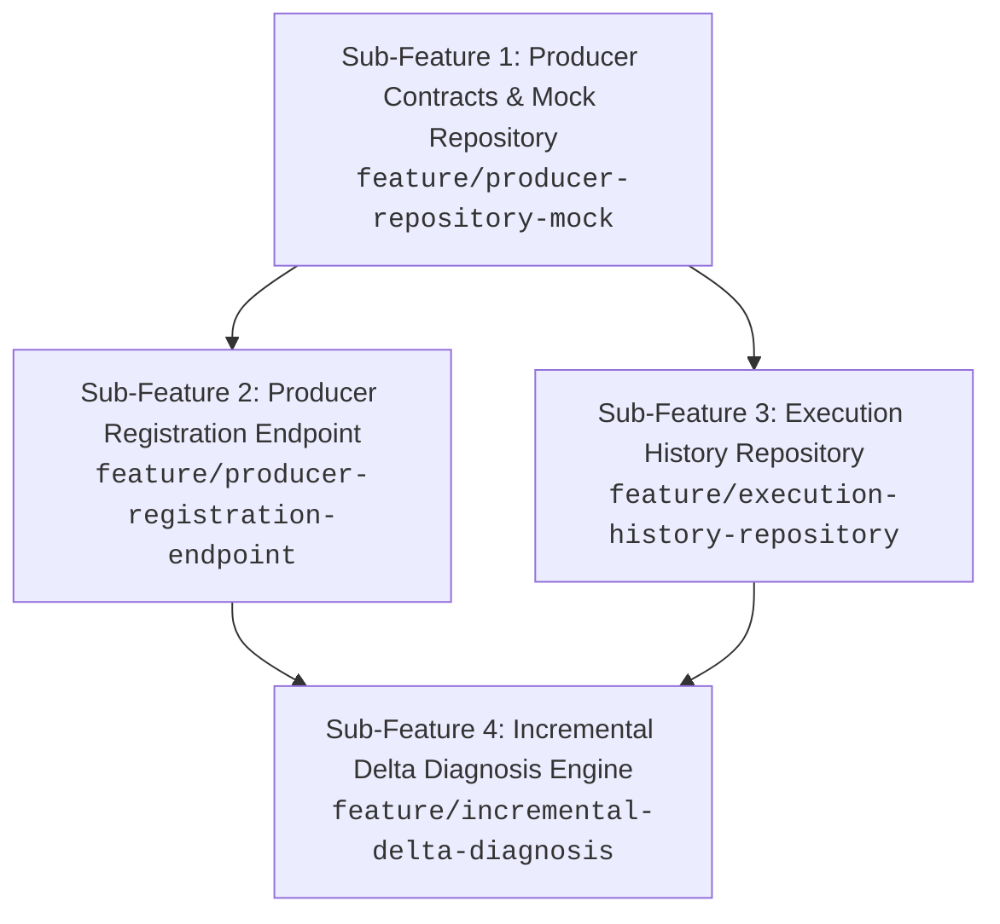

# Epic Decomposition Example: Producer Management & Delta Diagnosis

This example documents the practical breakdown of an API epic into 4 independent, evolutionary sub-features.

---

## 🎯 Epic Vision
Eliminate latency and high LLM costs caused by repetitive diagnoses, replacing the static `farms.json` file with typed repositories (initial mock), producer registration, and an incremental delta diagnosis engine.

---

## 🏗️ Dependency Graph

---

## 📋 Sub-Feature Briefs

### 1. `feature/producer-repository-mock`
* **Objective:** Establish the `IProducerRepository` interface and implement `InMemoryProducerRepository` seeded with `farms.json` data.
* **Deliverables:** `Producer` and `Farm` models, lookup contracts by ID and email.
* **Impact:** Zero existing routes broken; solid foundation for upcoming features.

### 2. `feature/producer-registration-endpoint`
* **Objective:** Create `POST /api/producers` endpoint for registration with password hashing and duplicate email checks.
* **Deliverables:** Pydantic schema, password hashing, route handler consuming `IProducerRepository`.

### 3. `feature/execution-history-repository`
* **Objective:** Model contracts and mock persistence for inputs/outputs of diagnoses, benchmarks, and simulations.
* **Deliverables:** `IDiagnosticHistoryRepository` interface and diagnosis storage per producer.

### 4. `feature/incremental-delta-diagnosis`
* **Objective:** Implement payload difference comparator to call LLM only for affected pillars.
* **Deliverables:** Delta algorithm, surgical LLM orchestration, and automatic history logging.
