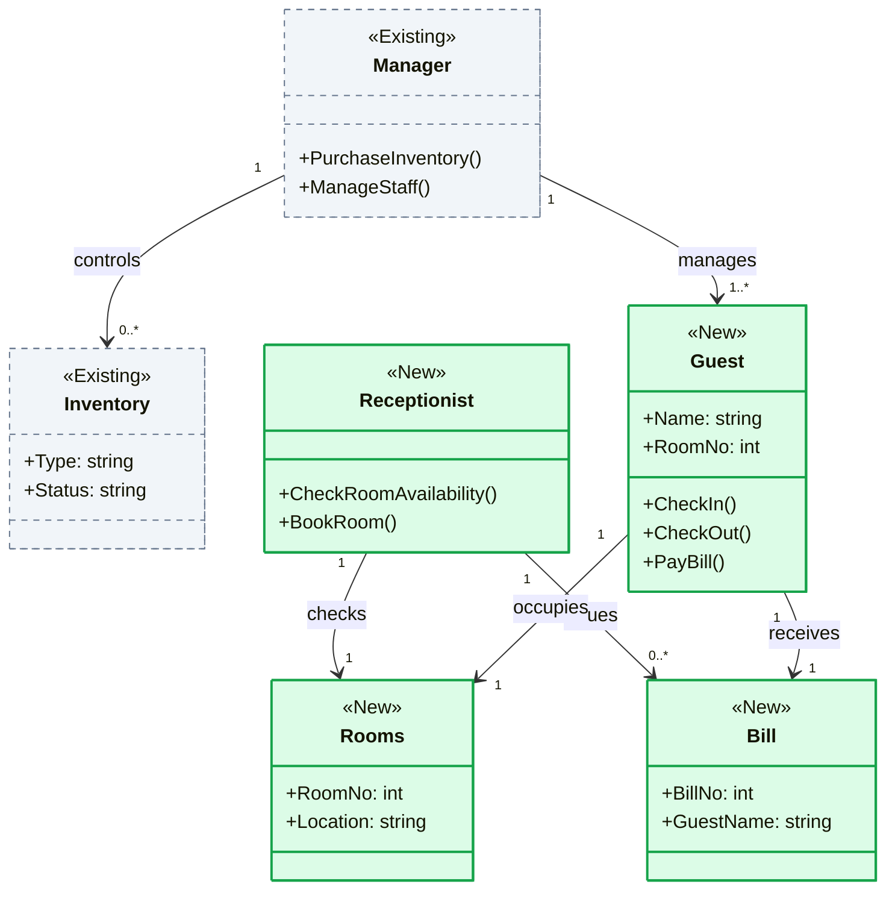

# Macro Class Diagram Conventions & Delta Modeling (`classDiagram`)

This document establishes the architectural standard for constructing the **Macro Class Diagram (Architectural Delta)** at the **Epic Blueprint** level (`skills/plan-decompose`).

---

## 1. Architectural Purpose at Epic Level

At the Epic level, the Class Diagram serves as a **domain and boundary map**. Its purpose is **NOT** to specify detailed implementation code (which is delegated to the SDD), but to immediately clarify:
1. **What already exists in the system (*As-Is*)?**
2. **What will be introduced in this Epic (*To-Be*)?**
3. **Which existing entities will undergo behavioral or contract changes (*Modified*)?**
4. **How do new entities couple to legacy entities and what are the essential cardinalities?**

---

## 2. Strict Stereotype and Styling Conventions (Mermaid)

Every entity in the Epic Class Diagram **MUST** have an explicit stereotype and standardized visual styling:

| Stereotype | Meaning | Mermaid Styling |
|---|---|---|
| `<<Existing>>` | Component already implemented in the system. | Light slate background, dashed slate border: `style Name fill:#f1f5f9,stroke:#64748b,stroke-dasharray: 5 5` |
| `<<New>>` | Entity or service to be created in the sub-features of this Epic. | Light emerald background, solid green border (2px): `style Name fill:#dcfce7,stroke:#16a34a,stroke-width:2px` |
| `<<Modified>>` | Pre-existing entity whose contract, attributes, or methods will change in this Epic. | Light amber background, solid amber border (2px): `style Name fill:#fef3c7,stroke:#d97706,stroke-width:2px` |

---

## 3. Mermaid Syntax Standard & Structure

---

## 4. Abstraction Boundaries: What to Include vs. What to Omit

To preserve the **Anti-Bureaucracy & Token Economy Directive**:

### WHAT MUST BE INCLUDED IN THE EPIC
* Core domain entities and aggregates involved in the Epic.
* Essential identity and business attributes (e.g., `Id`, `Status`, `Amount`).
* High-level operations representing business intent (e.g., `CheckIn()`, `CalculateDelta()`).
* Explicit cardinalities on relationships (`"1"`, `"0..1"`, `"1..*"`, `"0..*"`).
* Descriptive labels on relationship arrows (e.g., `: occupies`, `: issues`).

### STRICTLY PROHIBITED IN THE EPIC (Delegated to `/plan` / SDD)
* Private, helper, or infrastructure methods (e.g., `-_validate_format()`, `+__repr__()`).
* Redundant getters, setters, or property accessors.
* Third-party framework details (e.g., `pydantic.BaseModel`, `SQLAlchemy.Base`).
* Overly granular primitive type signatures across dozens of parameters.
* Transient transport models (internal request/response DTOs belong in the SDD).

---

## 5. Class Diagram Compliance Checklist

Before finalizing the Epic Blueprint, verify:
- [ ] Does every entity have a stereotype: `<<Existing>>`, `<<New>>`, or `<<Modified>>`?
- [ ] Do existing classes use slate/dashed styling and new classes use green/solid styling?
- [ ] Do relationship cardinalities represent business rules without ambiguity?
- [ ] Is the model strictly at the domain level, free from low-level implementation noise?
