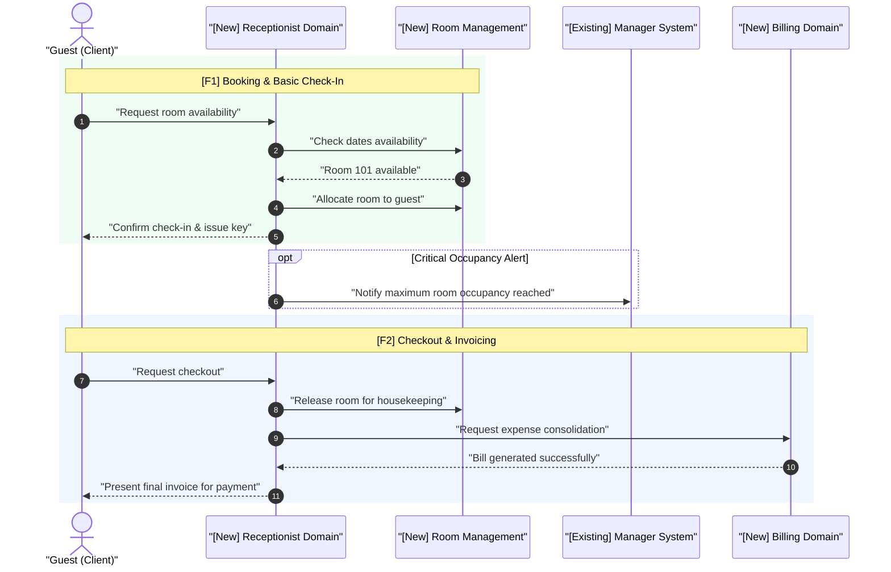

# Macro Business Journey Conventions (`sequenceDiagram`)

This document establishes the architectural standard for constructing the **Macro Sequence Diagram (End-to-End Business Journey)** at the **Epic Blueprint** level (`skills/plan-decompose`).

---

## 1. 🎯 Architectural Purpose at Epic Level

The Macro Sequence Diagram models the **dynamic and temporal behavior** of the Epic:
1. Demonstrates how business value flows end-to-end through actors and subsystems.
2. Explicitly highlights **interactions crossing sub-feature boundaries** (F1, F2, F3...).
3. Serves as a visual justification for the Roadmap dependency graph.
4. Identifies synchronization points, asynchronous events, and business decision branches (`alt`, `opt`) in advance.

---

## 2. 👥 Participants and Subsystem Stereotypes

Participants in the macro sequence diagram do **NOT** represent technical classes or controllers. They represent:
* **Human actors or external systems:** `actor Name as "Description"`
* **Subsystems / Domain Modules:** `participant Id as "[Status] Domain Name"`

| Label Tag | Meaning | Example |
|---|---|---|
| `[Existing]` | Subsystem, API, or service already in production. | `participant Inv as "[Existing] Inventory System"` |
| `[New]` | Subsystem or core domain entity to be implemented in this Epic. | `participant Book as "[New] Booking Domain"` |
| `[Modified]` | Existing subsystem receiving new routes, events, or contracts. | `participant Mgr as "[Modified] Management Service"` |

---

## 3. 📐 Mermaid Syntax Standard & Feature Traceability

The use of `autonumber`, double quotes on message labels, and grouping blocks (`rect` / notes) mapping which Roadmap sub-features (`F1`, `F2`...) realize each phase is **mandatory**:

---

## 4. ⚖️ Abstraction Boundaries: What to Include vs. What to Omit

### ✅ WHAT MUST BE INCLUDED IN THE EPIC
* External actors and primary domain subsystems.
* Continuous temporal progression of the user/business journey (from trigger to final business outcome).
* Critical business alternative paths (`alt` approval vs. rejection, `opt` notifications or reconciliations).
* Explicit traceability connecting journey phases to Roadmap sub-features (`[F1]`, `[F2]`).
* High-level asynchronous transitions or domain messaging events.

### 🚫 STRICTLY PROHIBITED IN THE EPIC (Delegated to `/plan` / SDD)
* Internal technical layer calls (e.g., `Controller -> Service -> Repository`).
* Direct database connections, ORM transactions, or raw SQL queries.
* Micro-validations on primitive fields (e.g., email format regex).
* Low-level technical exception handling (e.g., `HTTP 500`, `ConnectionTimeout` belong in the SDD).

---

## 5. 🔍 Macro Sequence Diagram Compliance Checklist

Before finalizing the Epic Blueprint, verify:
- [ ] Is the `autonumber` directive present?
- [ ] Are all participants tagged as `[Existing]`, `[New]`, or `[Modified]`?
- [ ] Are all message labels strictly enclosed in double quotes (`"..."`)?
- [ ] Are journey phases visually mapped to Roadmap sub-features (`[F1]`, `[F2]`...)?
- [ ] Does the flow remain at the business journey level without descending into class method calls?
