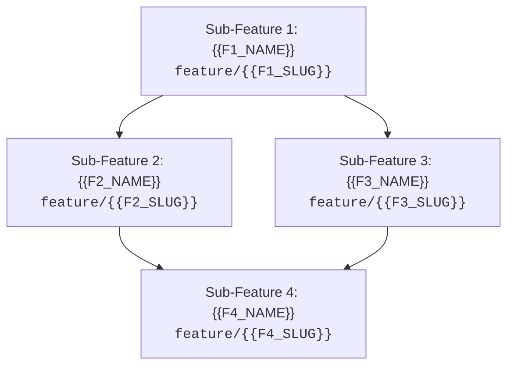

# 🗺️ Epic Blueprint: {{EPIC_TITLE}}

## 🎯 1. Overview & Desired End-State
* **Legacy Problem:** {{LEGACY_PROBLEM}}
* **Expected Outcome:** {{FINAL_OUTCOME}}

---

## 🏗️ 2. Sub-Feature Dependency Graph

---

## 📋 3. Sequential Sub-Feature Roadmap

### 🔹 Sub-Feature 1: `feature/{{F1_SLUG}}` - {{F1_NAME}}
* **Objective:** {{F1_OBJECTIVE}}
* **Contracts / Abstractions Introduced:** {{F1_CONTRACTS}}
* **Completion Criteria:** {{F1_DOD}}
* **Next Step:** Run `/plan` on this branch.

---

### 🔹 Sub-Feature 2: `feature/{{F2_SLUG}}` - {{F2_NAME}}
* **Dependency:** Requires `feature/{{F1_SLUG}}` completed and merged into `develop`.
* **Objective:** {{F2_OBJECTIVE}}
* **Contracts / Abstractions Introduced:** {{F2_CONTRACTS}}
* **Completion Criteria:** {{F2_DOD}}

---

### 🔹 Sub-Feature 3: `feature/{{F3_SLUG}}` - {{F3_NAME}}
* **Dependency:** Requires `feature/{{F1_SLUG}}` completed and merged into `develop`.
* **Objective:** {{F3_OBJECTIVE}}
* **Contracts / Abstractions Introduced:** {{F3_CONTRACTS}}
* **Completion Criteria:** {{F3_DOD}}

---

### 🔹 Sub-Feature 4: `feature/{{F4_SLUG}}` - {{F4_NAME}}
* **Dependency:** Requires `feature/{{F2_SLUG}}` and `feature/{{F3_SLUG}}` completed.
* **Objective:** {{F4_OBJECTIVE}}
* **Final Integration:** {{F4_INTEGRATION}}
* **Completion Criteria:** {{F4_DOD}}
