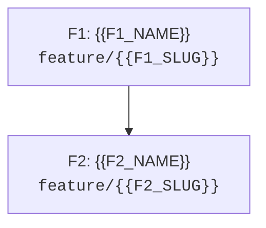

# 🗺️ Epic Blueprint: {{EPIC_TITLE}}

## 1. Problem & Desired Observable Outcome

### Current State & Problem
{{CURRENT_STATE_AND_PROBLEM}}

### Affected Users or Systems
{{AFFECTED_USERS_OR_SYSTEMS}}

### Desired Observable Outcome
{{DESIRED_OBSERVABLE_OUTCOME}}

### Epic Success Criteria

| ID | Verifiable Outcome | Validation Method |
|---|---|---|
| S1 | {{SUCCESS_CRITERION}} | {{VALIDATION_METHOD}} |

<!--
Note: For quantitative targets, specify baseline, target, and measurement window.
If baseline is currently unknown, describe how it will be measured. Do not invent metrics.
-->

---

## 2. Scope & Boundaries

### In-Scope
- {{IN_SCOPE_ITEM}}

### Out-of-Scope (Non-Goals)
- {{OUT_OF_SCOPE_ITEM}}

### Constraints
- {{TECHNICAL_BUSINESS_OR_OPERATIONAL_CONSTRAINT}}

---

## 3. Architectural Context & Decisions

### Relevant Existing State
- {{EXISTING_COMPONENT_OR_FLOW}}

### Proposed High-Level Approach
{{HIGH_LEVEL_APPROACH}}

### Invariants to Preserve
- {{EXISTING_BEHAVIOR_OR_COMPATIBILITY_GUARANTEE}}

### References & ADRs
- {{CODE_OR_DOCUMENT_REFERENCE}}
- {{ADR_LINK_IF_APPLICABLE}}

---

## 4. Shared Boundary Contracts

<!--
Document ONLY contracts that cross sub-feature or external boundaries.
Never speculate methods without an identified immediate consumer.
-->

| ID | Contract / Boundary | Relevant Guarantees | Introduced In | Consumed By |
|---|---|---|---|---|
| C1 | {{CONTRACT_NAME}} | {{BEHAVIOR_ERRORS_INVARIANTS}} | F1 | {{FEATURE_IDS}} |

### Contract Validation Strategy
- **Test Doubles:** {{FAKES_MOCKS_OR_NONE}}
- **Fixtures & Isolation:** {{SEED_RESET_AND_DATA_SOURCE}}
- **Validation with Real Adapters:** {{CONTRACT_AND_INTEGRATION_TEST_APPROACH}}
- **Evolution Policy:** {{COMPATIBILITY_AND_MIGRATION_APPROACH}}

---

## 5. Risks, Hypotheses & Pending Decisions

| ID | Risk / Hypothesis / Uncertainty | Impact | Mitigation / Validation Timing | Owner |
|---|---|---|---|---|
| R1 | {{RISK_OR_HYPOTHESIS}} | {{IMPACT}} | {{MITIGATION_FEATURE_OR_SPIKE}} | {{OWNER}} |

### Blocking Questions for Kickoff
- {{BLOCKING_QUESTION_OR_NONE}}

<!--
If a critical technical uncertainty prevents reliable slicing,
decompose a timeboxed Spike before proceeding.
-->

---

## 6. Roadmap & Dependency Graph

### Summary Table

| ID | Feature | Type | Observable Outcome | Depends On |
|---|---|---|---|---|
| F1 | {{F1_NAME}} | Vertical Slice | {{F1_OBSERVABLE_RESULT}} | — |
| F2 | {{F2_NAME}} | Vertical Slice | {{F2_OBSERVABLE_RESULT}} | F1 |

### Dependency Graph



<!--
Dynamic Graph: Nodes and edges must strictly match the Roadmap table.
The graph must be a strict Directed Acyclic Graph (DAG).
-->

---

## 7. Sub-Feature Specifications

<!-- 
Repeat this block for each sub-feature in the epic.
Strictly avoid micro-level file lists, TDD ordering, or class methods (delegate to /plan).
-->

### {{FEATURE_ID}} — {{FEATURE_NAME}}

- **Branch:** `feature/{{FEATURE_SLUG}}`
- **Type:** {{VERTICAL_SLICE_OR_TECHNICAL_ENABLER_OR_SPIKE}}
- **Status:** Planned
- **Objective:** {{SINGLE_COHERENT_OBJECTIVE}}
- **Demonstrable Outcome:** {{WHAT_BECOMES_POSSIBLE}}
- **Contributes to:** {{EPIC_SUCCESS_CRITERIA_IDS}}

#### Scope
- {{INCLUDED_BEHAVIOR}}

#### Out of Scope
- {{EXPLICIT_EXCLUSION}}

#### Dependencies & Readiness
- **Requires:** {{FEATURE_IDS_OR_NONE}}
- **Dependency Rationale:** {{CAPABILITY_OR_CONTRACT_REQUIRED}}
- **Ready to Start When:** {{DEPENDENCIES_MERGED_AND_DECISIONS_RESOLVED}}

#### Contracts & Compatibility
- **Introduces:** {{CONTRACT_IDS_OR_NONE}}
- **Consumes:** {{CONTRACT_IDS_OR_NONE}}
- **Modifies / Deprecates:** {{CONTRACT_IDS_OR_NONE}}
- **Preserves:** {{RELEVANT_EXISTING_GUARANTEES}}

#### Acceptance Criteria
- [ ] {{OBSERVABLE_SUCCESS_SCENARIO}}
- [ ] {{RELEVANT_ERROR_OR_EDGE_SCENARIO}}
- [ ] {{COMPATIBILITY_OR_REGRESSION_SCENARIO}}

#### Integration & Rollout
- **Integration with Existing Code:** {{INTEGRATION_APPROACH}}
- **Availability Post-Merge:** {{ENABLED_DISABLED_OR_INTERNAL_ONLY}}
- **Reversal / Fallback:** {{ROLLBACK_APPROACH_OR_NOT_APPLICABLE}}

#### Risks & Scope Warnings
- **Relevant Risks:** {{RISK_IDS_OR_NONE}}
- **Signal that Slicing is Needed:** {{CONCRETE_SCOPE_WARNING}}

#### Handover to `/plan`
- **Mandatory Context:** {{LINKS_AND_DECISIONS}}
- **Delegated Local Decisions:** {{IMPLEMENTATION_DETAILS_DELEGATED_TO_PLAN}}

---

## 8. Common Feature Definition of Done

- [ ] Specific acceptance criteria for this sub-feature are met and evidenced by automated tests.
- [ ] All unit and integration tests pass, with 100% green regression suite.
- [ ] Affected contracts verified with strict typing and proper isolation.
- [ ] Code review approved and CI green on the integration branch.
- [ ] Local documentation and configurations updated where applicable.
- [ ] Feature merged into the base branch (`develop`) without depending on open PRs or unmerged branches.
- [ ] Epic blueprint updated if implementation revealed architectural discoveries.

---

## 9. Epic Transition & Delivery

<!--
ANTI-BUREAUCRACY DIRECTIVE:
Fill concisely only if applicable to this epic.
If an item is not applicable, mark as 'N/A: [brief reason]' in a single line.
-->

- **Legacy Coexistence:** {{COEXISTENCE_APPROACH_OR_NA}}
- **Data Persistence & Migration:** {{DATA_TRANSITION_OR_NA}}
- **Real Integration Validation:** {{WHEN_AND_HOW_REAL_ADAPTERS_ARE_VALIDATED}}
- **Security & Privacy:** {{SECURITY_REQUIREMENTS_OR_NA}}
- **Observability & Metrics:** {{SIGNALS_OR_TELEMETRY_REQUIRED}}
- **Rollout Strategy:** {{ROLLOUT_APPROACH}}
- **Rollback & Data Limitations:** {{REVERSAL_APPROACH_AND_DATA_LIMITATIONS}}
- **Post-Launch Cleanup:** {{FLAGS_ADAPTERS_OR_LEGACY_CLEANUP_OR_NA}}

---

## 10. Epic Closure Criteria

- [ ] All planned sub-features completed and merged into `develop`.
- [ ] End-to-end journey validated in integration/staging environment.
- [ ] Epic success criteria (S1..Sn) measured and verified with concrete evidence.
- [ ] Operational, security, and compatibility requirements signed off.
- [ ] Data transitions and migrations executed (if applicable).
- [ ] Remaining non-blocking technical debt explicitly tracked as new issues.
- [ ] Final architecture documentation and maintenance handover completed.

---

## 11. Approval & Next Steps

- **Approval Status:** Pending Approval
- **Approved by / Date:** {{APPROVER_AND_DATE}}
- **First Unlocked Feature:** `{{FIRST_FEATURE_ID}}`
- **Transition Command:**
  ```bash
  git switch develop && git pull --ff-only && git switch -c feature/{{FIRST_FEATURE_SLUG}}
  ```
- **Next Action:** Open a new focused chat session for the first feature and execute `/plan`.

### Decision History & Approved Scope Changes
- {{DATE}} — Initial epic blueprint authored.

