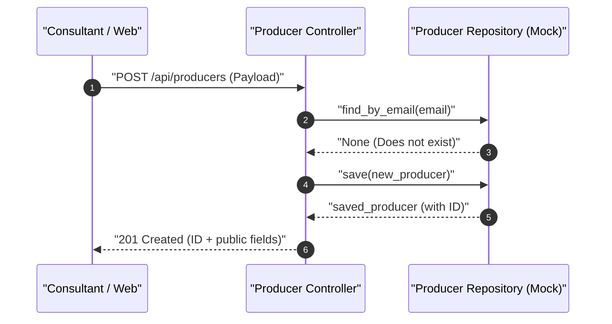
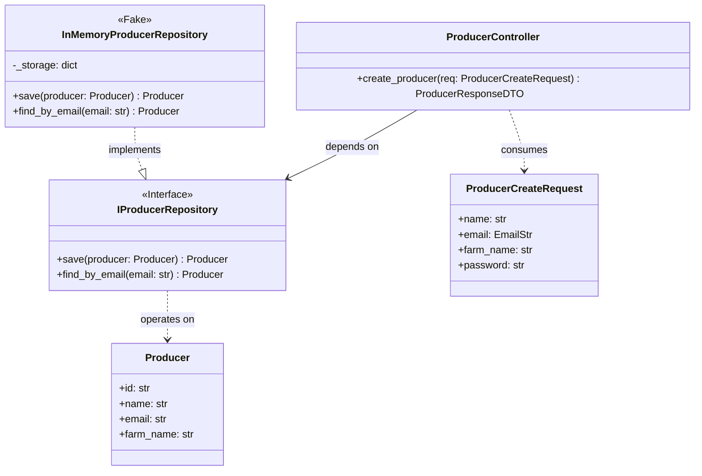

# SDD Technical Specification Example

---

## 📋 Sequential Implementation Plan

| # | Action | Rationale | Technical Acceptance Criteria | Dependency |
|---|---|---|---|---|
| 1 | Create `ProducerCreateRequest` DTO in `schemas/producer.py` | Define input contract with email and password validations | Pydantic rejects invalid emails or short passwords | — |
| 2 | Create `IProducerRepository` interface in `ports/repositories.py` | Isolate persistence dependency to enable in-memory mock | `save` and `find_by_email` methods strictly typed | Step 1 |
| 3 | Implement `InMemoryProducerRepository` in `adapters/in_memory.py` | Provide in-memory persistence for testing cycle | Mock repository stores and retrieves entities | Step 2 |

---

## 🏗️ Architecture & Contracts

### Technical Execution Flow (Sequence Diagram) [Mandatory]



### Component & Contract Structure (Class Diagram) [Mandatory]



### Typed Contracts & Boundary Mocks [Mandatory]

```python
from pydantic import BaseModel, Field, EmailStr

class ProducerCreateRequest(BaseModel):
    name: str = Field(..., min_length=2, description="Full name")
    email: EmailStr = Field(..., description="Unique email")
    farm_name: str = Field(..., description="Rural property name")
    password: str = Field(..., min_length=6, description="Access password")
```
