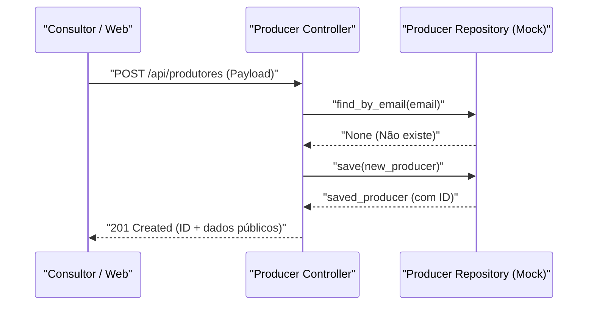

# Exemplo de Especificação Técnica SDD

---

## 📋 Plano Sequencial de Implementação

| # | O Que Fazer | Justificativa | Critério de Aceite Técnico | Dependência |
|---|---|---|---|---|
| 1 | Criar DTO `ProducerCreateRequest` em `schemas/producer.py` | Definir contrato de entrada com validação de e-mail e senha | Pydantic rejeitando e-mails inválidos ou senha curta | — |
| 2 | Criar interface `IProducerRepository` em `ports/repositories.py` | Isolar dependência de persistência para permitir mock | Métodos `save` e `find_by_email` definidos com tipagem estrita | Passo 1 |
| 3 | Implementar `InMemoryProducerRepository` em `adapters/in_memory.py` | Prover persistência em memória para ciclo de testes | Repositório mock persistindo e recuperando entidades | Passo 2 |

---

## 🏗️ Arquitetura e Contratos



```python
from pydantic import BaseModel, Field, EmailStr

class ProducerCreateRequest(BaseModel):
    name: str = Field(..., min_length=2, description="Nome completo")
    email: EmailStr = Field(..., description="E-mail único")
    farm_name: str = Field(..., description="Nome da propriedade rural")
    password: str = Field(..., min_length=6, description="Senha de acesso")
```
