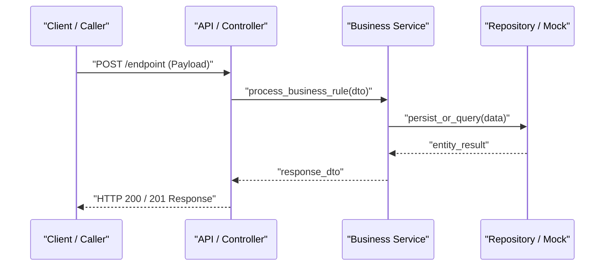

# 📐 Technical Specification (SDD): {{FEATURE_NAME}}

---

## 🎯 1. Technical Goal
{{TECHNICAL_GOAL}}

---

## ⚠️ 2. Critical Decisions & Design Choices
> [!IMPORTANT]
> {{CRITICAL_DECISIONS_AND_DEPENDENCIES}}

---

## 📋 3. Sequential Implementation Plan

| # | Action | Rationale | Technical Acceptance Criteria | Dependency |
|---|---|---|---|---|
| 1 | {{STEP_1_DESC}} | {{STEP_1_WHY}} | {{STEP_1_CRITERIA}} | — |
| 2 | {{STEP_2_DESC}} | {{STEP_2_WHY}} | {{STEP_2_CRITERIA}} | Step 1 |

---

## 🏗️ 4. Architecture & Contracts

### Sequence Diagram (Mermaid)



### Typed Contracts & Boundary Mocks

```python
# Typed Contracts using Pydantic
from pydantic import BaseModel, Field, EmailStr

class ExampleRequestDTO(BaseModel):
    email: EmailStr = Field(..., description="Unique user email")

class ExampleResponseDTO(BaseModel):
    id: str = Field(..., description="Unique entity identifier")
    status: str = Field(default="active")
```

---

## 💥 5. File Impact Analysis

| File / Module | Change Type | Risk | Notes |
| --- | --- | --- | --- |
| `path/to/new_file.py` | Additive (New) | Low | Isolated component |
| `path/to/existing_file.py` | Mutative (Edit) | Medium | Adapting behavior |

---

## 🔗 Related Context & Notes
* [[bdd-{{FEATURE_SLUG}}]]
* [[dod-{{FEATURE_SLUG}}]]
