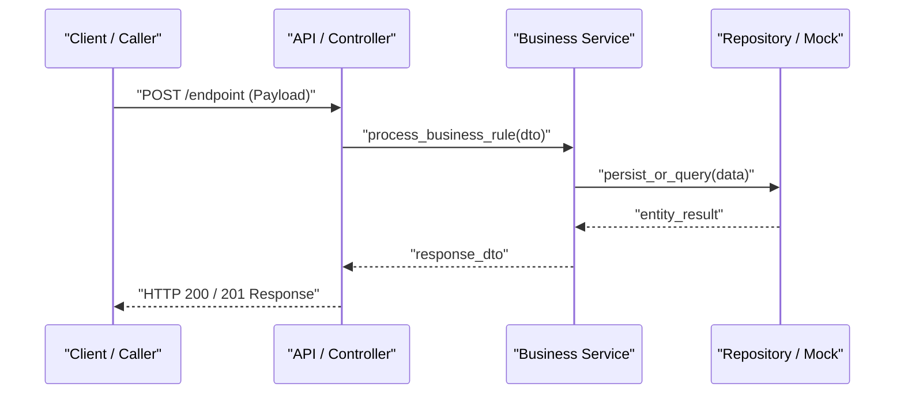

# 📐 Especificação Técnica (SDD): {{FEATURE_NAME}}

---

## 🎯 1. Objetivo Técnico
{{TECHNICAL_GOAL}}

---

## ⚠️ 2. Pontos Críticos e Decisões de Design
> [!IMPORTANT]
> {{CRITICAL_DECISIONS_AND_DEPENDENCIES}}

---

## 📋 3. Plano Sequencial de Implementação

| # | O Que Fazer | Justificativa | Critério de Aceite Técnico | Dependência |
|---|---|---|---|---|
| 1 | {{STEP_1_DESC}} | {{STEP_1_WHY}} | {{STEP_1_CRITERIA}} | — |
| 2 | {{STEP_2_DESC}} | {{STEP_2_WHY}} | {{STEP_2_CRITERIA}} | Passo 1 |

---

## 🏗️ 4. Arquitetura e Contratos

### Diagrama de Sequência (Mermaid)



### Contratos Tipados e Mocks de Fronteira

```python
# Contratos Tipados em Pydantic
from pydantic import BaseModel, Field, EmailStr

class ExampleRequestDTO(BaseModel):
    email: EmailStr = Field(..., description="E-mail único do usuário")

class ExampleResponseDTO(BaseModel):
    id: str = Field(..., description="Identificador único")
    status: str = Field(default="active")
```

---

## 💥 5. Análise de Impacto em Arquivos

| Arquivo / Módulo | Tipo de Mudança | Risco | Observações |
| --- | --- | --- | --- |
| `path/to/new_file.py` | Aditiva (Novo) | Baixo | Componente isolado |
| `path/to/existing_file.py` | Mutativa (Alteração) | Médio | Adaptação de comportamento |

---

## 🔗 Contexto Relacionado
* [[bdd-{{FEATURE_SLUG}}]]
* [[dod-{{FEATURE_SLUG}}]]
