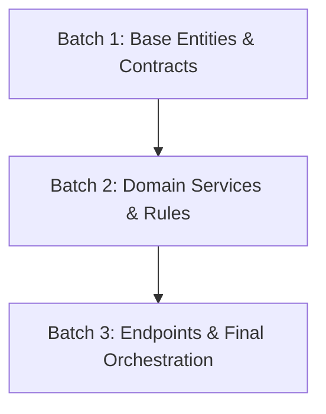

# TDD Implementation Plan (`implementation_plan.md`)

**Feature Slug:** `{{FEATURE_SLUG}}`
**Git Branch:** `{{BRANCH_NAME}}`
**Contracts Loaded:**
- BDD: `[[01-concepcao/bdd-{{FEATURE_SLUG}}.md]]`
- SDD: `[[01-concepcao/sdd-{{FEATURE_SLUG}}.md]]`

---

## 📐 1. Architecture & Batch Strategy
Briefly describe how functionality was divided into Dependent Context Batches for token efficiency and surgical focus.

---

## 🔗 2. Technical Dependency Graph

---

## 🎯 3. Context Batches Summary

| Batch | Domain / Responsibility | Affected Components | Risk |
| --- | --- | --- | --- |
| **Batch 1** | Base data structures & contracts | `src/domain/`, `src/repositories/` | Low |
| **Batch 2** | Business rules & use cases | `src/services/` | Medium |
| **Batch 3** | Controllers & routes | `src/controllers/`, `src/routes/` | Low |
