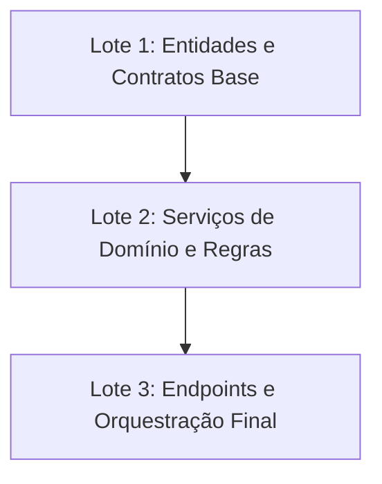

# TDD Implementation Plan (`implementation_plan.md`)

**Feature Slug:** `{{FEATURE_SLUG}}`
**Git Branch:** `{{BRANCH_NAME}}`
**Contratos Lidos:**
- BDD: `[[01-concepcao/bdd-{{FEATURE_SLUG}}.md]]`
- SDD: `[[01-concepcao/sdd-{{FEATURE_SLUG}}.md]]`

---

## 📐 1. Arquitetura e Estratégia de Lotes
Descreva sucintamente como a funcionalidade foi dividida em Unidades de Contexto Dependentes para otimização de contexto e foco cirúrgico.

---

## 🔗 2. Grafo de Dependências Técnicas

---

## 🎯 3. Resumo dos Lotes de Contexto

| Lote | Domínio / Responsabilidade | Componentes Afetados | Risco |
| --- | --- | --- | --- |
| **Lote 1** | Estruturas base de dados e contratos | `src/domain/`, `src/repositories/` | Baixo |
| **Lote 2** | Regras de negócio e casos de uso | `src/services/` | Médio |
| **Lote 3** | Controladores e rotas | `src/controllers/`, `src/routes/` | Baixo |
