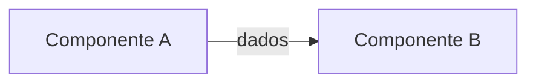

# {{FEATURE_TITLE}}

{{FEATURE_SUMMARY}}

**Feature Slug:** `{{FEATURE_SLUG}}` | **Branch:** `{{BRANCH_NAME}}`
**Contratos Carregados:**
- BDD: `[[01-concepcao/bdd-{{FEATURE_SLUG}}.md]]`
- SDD: `[[01-concepcao/sdd-{{FEATURE_SLUG}}.md]]`

---

## Contexto e Motivação

{{CONTEXTO_E_MOTIVACAO}}
- Diagnóstico do cenário atual e problema a ser resolvido.
- Causa raiz e gargalos identificados.

---

## Decisões de Design Consolidadas (Entrevista)

| Decisão | Escolha / Estratégia |
|---|---|
| **Estratégia de Mock / Fronteira** | {{MOCK_STRATEGY}} |
| **Primitivas / Bibliotecas** | {{PRIMITIVAS}} |
| **Compatibilidade & Regras** | {{COMPATIBILIDADE}} |
| **Suíte de Testes** | {{TEST_FRAMEWORK}} |

---

## Arquitetura Proposta



### Fluxo de Dados Detalhado

1. **Passo 1:** {{DESCRICAO_PASSO_1}}
2. **Passo 2:** {{DESCRICAO_PASSO_2}}
3. **Passo 3:** {{DESCRICAO_PASSO_3}}

---

## Proposta de Mudanças

### Componente: {{COMPONENTE_1_NOME}}

#### [NEW] [test_{{COMPONENTE_A}}.py](file:///{{PATH_TESTS}}/test_{{COMPONENTE_A}}.py)
- Testes unitários AAA cobrindo Happy Path, Edge Cases e Exceções.

#### [NEW] [{{COMPONENTE_A}}.py](file:///{{PATH_SRC}}/{{COMPONENTE_A}}.py)
- Métodos, assinaturas e regras de negócio essenciais.

---

### Componente: {{COMPONENTE_2_NOME}}

#### [MODIFY] [{{COMPONENTE_B}}.py](file:///{{PATH_SRC}}/{{COMPONENTE_B}}.py)
- Alterações previstas, assinaturas atualizadas e integrações.

---

## Verificação

### Testes Automatizados
```bash
pytest tests/unit/ -v
```
