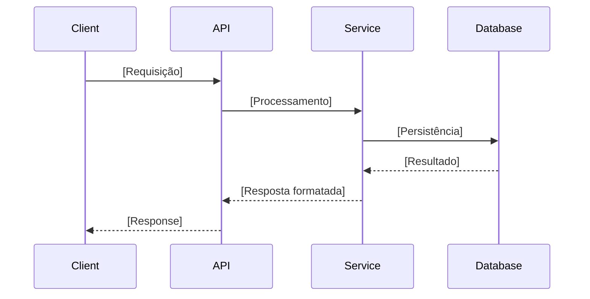
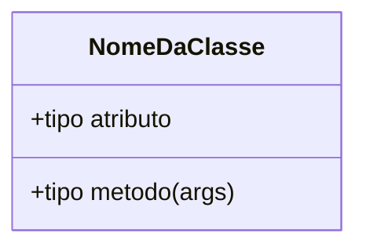

# 📐 Plano de Implementação: [Nome da Feature]

> **Data:** [AAAA-MM-DD]
> **Status:** [Em Análise / Aprovado / Em Execução / Concluído]
> **Autor:** [Nome]

---

## 🎯 Objetivo

*Descreva o problema que esta implementação resolve e o resultado esperado após a conclusão.*

---

## 📋 Plano Sequencial

| # | O Quê | Por Quê | Critério de Aceite | Dependências |
|---|---|---|---|---|
| 1 | [Descrição da mudança — arquivo/função] | [Regra de negócio ou rationale] | [Condição testável que prova que está feito] | — |
| 2 | [Próxima mudança] | [Justificativa] | [Critério] | Etapa 1 |
| 3 | ... | ... | ... | ... |

---

## 🏗️ Arquitetura e Contratos (Abordagem SDD)

*Gere os diagramas UML estritamente em formato Mermaid.js e documente os contratos/esquemas de validação mockados antes de iniciar a lógica de produção.*

> **Futura Nota no Obsidian:** `[[YYYY-MM-DD-slug-da-feature-arquitetura]]`

### Diagrama UML de Sequência



### Diagrama UML de Classes (se aplicável)



### Contratos e Esquemas (Mocks)

*Defina as interfaces falsas, esquemas de validação (ex: Pydantic, Zod) ou endpoints da API que atuarão como contrato para esta feature.*

```python
# Exemplo de Contrato / Mock
class FuncionalidadeSchema(BaseModel):
    campo: str
```

---

## 💥 Análise de Impacto

| Arquivo / Módulo | Tipo de Mudança | Risco |
|---|---|---|
| `path/to/file.py` | Aditiva (novo código) | Baixo — sem efeitos colaterais |
| `path/to/existing.py` | Mutativa (modificação) | Médio — pode afetar testes existentes |

---

## ✅ Checklist de Qualidade (Pré-Aprovação)

- [ ] Cada etapa possui critério de aceite testável
- [ ] Diagramas referenciam componentes reais do codebase
- [ ] Análise de impacto cobre todos os arquivos afetados
- [ ] Nenhum código de produção foi incluído neste plano

---

## Related Context

*Links para notas do vault que informaram este plano:*
- [[nota-relevante]]
