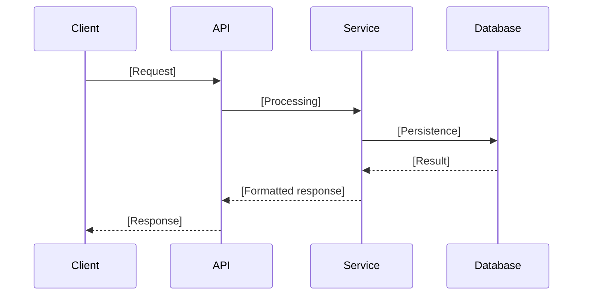
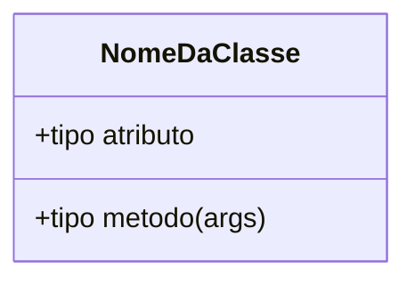

# 📐 Plano de Implementação: [Feature Name]

> **Data:** [YYYY-MM-DD]
> **Status:** [Under Analysis / Approved / In Execution / Completed]
> **Autor:** [Name]

---

## 🎯 Objetivo

*Describe the problem this implementation solves and the expected result upon completion.*

---

## 📋 Plano Sequencial

| # | O Quê | Por Quê | Critério de Aceite | Dependências |
|---|---|---|---|---|
| 1 | [Description of the change — file/function] | [Business rule or rationale] | [Testable condition that proves it's done] | — |
| 2 | [Next change] | [Justification] | [Criterion] | Etapa 1 |
| 3 | ... | ... | ... | ... |

---

## 🏗️ Arquitetura e Contratos (Abordagem SDD)

*Generate UML diagrams strictly in Mermaid.js format and document the mocked contracts/validation schemas before starting production logic.*

> **Futura Nota no Obsidian:** `[[YYYY-MM-DD-feature-slug-architecture]]`

### Diagrama UML de Sequência



### Diagrama UML de Classes (se aplicável)



### Contratos e Esquemas (Mocks)

*Define the fake interfaces, validation schemas (e.g., Pydantic, Zod), or API endpoints that will act as the contract for this feature.*

```python
# Exemplo de Contrato / Mock
class FuncionalidadeSchema(BaseModel):
    campo: str
```

---

## 💥 Análise de Impacto

| Arquivo / Módulo | Tipo de Mudança | Risco |
|---|---|---|
| `path/to/file.py` | Additive (new code) | Low — no side effects |
| `path/to/existing.py` | Mutative (modification) | Medium — may affect existing tests |

---

## ✅ Checklist de Qualidade (Pré-Aprovação)

- [ ] Each step has a testable acceptance criterion
- [ ] Diagrams reference real components from the codebase
- [ ] Impact analysis covers all affected files
- [ ] No production code was included in this plan

---

## Related Context

*Links to vault notes that informed this plan:*
- [[relevant-note]]
