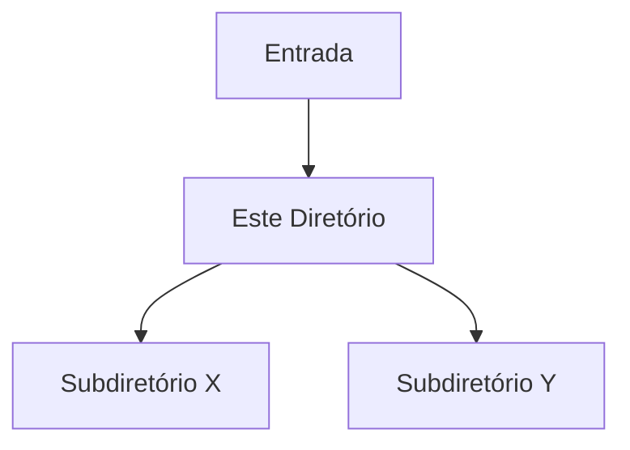

# 📁 [Nome do Diretório / Módulo]

> **Versão da Documentação:** 1.0.0
> **Última Atualização:** [AAAA-MM-DD]
> **Status:** [Ativo / Em Desenvolvimento / Legado]

---

## 🎯 Visão Geral (The Blueprint)

*Forneça um mergulho técnico profundo sobre o propósito deste diretório. Não foque em comandos de execução, mas sim na responsabilidade arquitetural deste módulo dentro do sistema.*

**Exemplo de preenchimento:**
> "Este diretório centraliza a lógica de processamento de filas e mensageria distribuída. Ele isola os drivers de infraestrutura (RabbitMQ/Kafka) do restante da aplicação, garantindo que a entrega de eventos seja idempotente através do padrão Outbox."

---

## 🏗️ Arquitetura e Fluxo de Dados

*Explique como os dados entram, são transformados e saem deste diretório. Se aplicável, use diagramas Mermaid.js ou referencie componentes externos.*

* **Entrada:** [Ex: Requisições HTTP da camada de rotas, eventos do broker]
* **Saída:** [Ex: Entidades persistidas no banco, respostas formatadas em JSON]

---

## 🗂️ Mapeamento de Componentes

*Mapeie cada arquivo relevante ou subdiretório imediato, detalhando sua responsabilidade única.*

### 📂 Subdiretórios

#### `📂 [nome-do-subdiretorio]/`

* **Responsabilidade:** [Breve descrição do papel deste subdiretório]
* **Contrato/Interface:** [Como outros módulos interagem com ele]

---

### 📄 Arquivos Chave

#### `📄 [nome_do_arquivo.ext]`

* **Responsabilidade:** [O que este arquivo faz especificamente?]
* **Principais Funções/Classes:**
    * `Classe/Função X`: [Breve resumo do papel técnico]
* **Dependências Críticas:** [Se depende fortemente de um pacote externo ou outro módulo]

---

## 🧠 Decisões de Design & Trade-offs

*Documente o raciocínio por trás da estrutura atual. Por que foi feito assim? Quais foram os desafios?*

* **Decisão:** [Ex: Uso de herança em vez de composição para os adapters]
* **Motivo:** [Ex: Redução de boilerplate dado o escopo fechado do framework]
* **Trade-off / Débito Técnico:** [Ex: Maior acoplamento com a classe mãe]

---

## 🧪 Estratégia de Testes

*Como este diretório específico é testado?*

* **Tipo de Teste dominante:** [Ex: Testes unitários com Pytest / Jest]
* **Cenários Críticos:** [Ex: Garantir que falhas de rede disparem retry após 3 tentativas]
* **Estratégia de Mocking:** [Ex: Chamadas de rede interceptadas via MSW / moxios]

---

## Related Context

*Links para notas do vault que documentam este módulo:*
- [[nota-relevante]]
