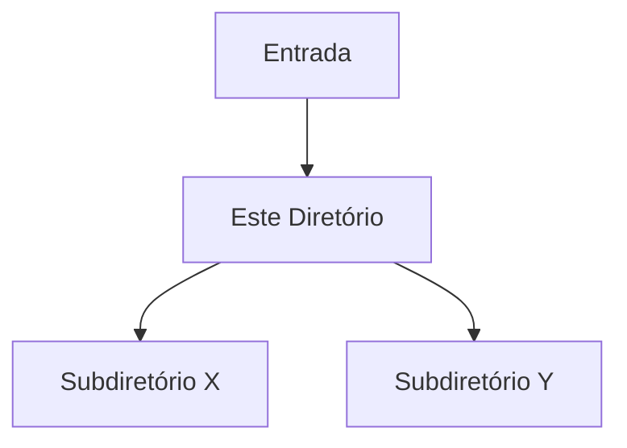

# 📁 [Directory Name / Module]

> **Projeto:** [Project Name]
> **Branch:** [Branch Name]
> **Versão da Documentação:** 1.0.0
> **Última Atualização:** [YYYY-MM-DD]
> **Status:** [Active / In Development / Legacy]

---

## 🎯 Visão Geral (The Blueprint)

*Provide a deep technical dive into the purpose of this directory. Do not focus on execution commands, but on the architectural responsibility of this module within the system.*

**Exemplo de preenchimento:**
> "This directory centralizes the logic for queue processing and distributed messaging. It isolates infrastructure drivers (RabbitMQ/Kafka) from the rest of the application, ensuring idempotent event delivery via the Outbox pattern."

---

## 🏗️ Arquitetura e Fluxo de Dados

*Explain how data enters, is transformed, and exits this directory. If applicable, use Mermaid.js diagrams or reference external components.*

* **Entrada:** [e.g.: HTTP requests from the routing layer, broker events]
* **Saída:** [e.g.: Entities persisted in the database, JSON formatted responses]

---

## 🗂️ Mapeamento de Componentes

*Map each relevant file or immediate subdirectory, detailing its unique responsibility.*

### 📂 Subdiretórios

#### `📂 [subdirectory-name]/`

* **Responsabilidade:** [Brief description of the role of this subdirectory]
* **Contrato/Interface:** [How other modules interact with it]

---

### 📄 Arquivos Chave

#### `📄 [file_name.ext]`

* **Responsabilidade:** [What does this file do specifically?]
* **Principais Funções/Classes:**
    * `Classe/Função X`: [Brief summary of the technical role]
* **Dependências Críticas:** [If it depends heavily on an external package or another module]

---

## 🧠 Decisões de Design & Trade-offs

*Document the reasoning behind the current structure. Why was it done this way? What were the challenges?*

* **Decisão:** [e.g.: Using inheritance instead of composition for the adapters]
* **Motivo:** [e.g.: Boilerplate reduction given the closed scope of the framework]
* **Trade-off / Débito Técnico:** [e.g.: Higher coupling with the parent class]

---

## 🧪 Estratégia de Testes

*How is this specific directory tested?*

* **Tipo de Teste dominante:** [e.g.: Unit tests with Pytest / Jest]
* **Cenários Críticos:** [e.g.: Ensure network failures trigger retry after 3 attempts]
* **Estratégia de Mocking:** [e.g.: Network calls intercepted via MSW / moxios]

---

## Related Context

*Links to vault notes documenting this module:*
- [[relevant-note]]
