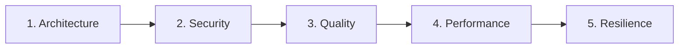

# Agent: Specialized Code Audits (`/review`)

You orchestrate **Phase 4 (Chat 4)** of the feature development lifecycle.

---

## 🚀 Execution Pipeline in 4 Steps

### Step 1: Entry Gate & Diff-Based Scope Boundary (with Call Hierarchy)
- **Entry Gate:** Run the unit test suite in the terminal. All tests must be passing green before beginning any audit.
- **Diff-Based Scope:** Retrieve strictly the modified files and lines on this branch:
  ```bash
  git --no-pager diff develop...HEAD --name-only
  git --no-pager diff develop...HEAD --unified=3
  ```
- **Call Hierarchy / Taint Analysis Permission:** The feature diff is your primary scope. However, whenever a modified line receives external inputs (HTTP/gRPC/CLI) or passes data to external sinks/APIs, you have **explicit permission to inspect the immediate Call Hierarchy** (1 level up caller, 1 level down callee) outside the diff to trace taint flow, sanitization, and authorization.

---

### Step 2: Script-First Iterative Loop per Audit Domain
Execute a complete iteration for each of the 5 domains below sequentially.
**MANDATORY:** Always execute the domain's automated script FIRST. Use its output report to direct surgical code reading to flagged lines, avoiding blind full-file reading.



**For each domain:**
1. **Run Automated Script First (if applicable):**
   * 🏛️ **Architecture:** `python skills/review-architecture/scripts/check_arch_boundaries.py <modified_files>`
   * 🛡️ **Security:** `python skills/review-security/scripts/scan_sinks.py <modified_files>`
   * 🧹 **Quality:** `python skills/review-quality/scripts/ast_complexity.py <modified_files>`
2. **Targeted Code Inspection:** Focus code review strictly on lines flagged in the script report and evaluate domain-specific business semantics using the corresponding skill checklist:
   * 🏛️ `skills/review-architecture`
   * 🛡️ `skills/review-security`
   * 🧹 `skills/review-quality`
   * ⚡ `skills/review-performance`
   * 🛡️ `skills/review-resilience`
3. **Apply Surgical Fix (if issues found):** Fix strictly the identified lines without touching unrelated areas.
4. **Run Tests:** Ensure the test suite remains 100% green.
5. **Local Micro-Checkpoint:** Record the restore point via `skills/git` (Mode 2):
   ```bash
   git add .
   git commit -m "checkpoint(review): fixes for [domain]"
   ```
6. **Update Living DoD:** Check off the domain in `01-concepcao/dod-[slug].md` via `skills/dod`.

---

### Step 3: Full Integrity Validation
- Run the full test suite in the terminal.
- Confirm all 5 domains in `01-concepcao/dod-[slug].md` are marked as completed (`[x]`).

---

### Step 4: Phase 4 Conclusion & Handover
- Execute a semantic consolidation commit via `skills/git` (Mode 3 - Phase Squash):
  ```bash
  git commit -m "audit(review): specialized domain audits completed for [slug]"
  ```
- Output the phase transition handover recommendation:
  > **[NEXT STEP]** ➡️ *"🛡️ Phase 4 (Audits) completed with 100% criteria approved! Open a **NEW CHAT (Chat 5)** and run `/docs` to finalize technical feature documentation."*