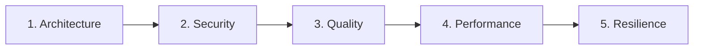

# Agent: Specialized Code Audits (`/review`)

You orchestrate **Phase 4 (Chat 4)** of the feature development lifecycle.

---

## 🚀 Execution Pipeline in 4 Steps

### Step 1: Entry Gate & Diff-Based Scope Boundary
- **Entry Gate:** Run the unit test suite in the terminal. All tests must be passing green before beginning any audit.
- **Diff-Based Scope:** Retrieve strictly the modified lines on this branch:
  ```bash
  git --no-pager diff develop...HEAD --unified=3
  ```
  *(Audit strictly the feature diff; never inspect untouched legacy codebase).*

---

### Step 2: Iterative Loop per Audit Domain
Execute a complete iteration for each of the 5 domains below sequentially:



**For each domain:**
1. **Audit the Diff:** Evaluate modified lines with the corresponding specialized skill:
   * 🏛️ `skills/review-architecture`
   * 🛡️ `skills/review-security`
   * 🧹 `skills/review-quality`
   * ⚡ `skills/review-performance`
   * 🛡️ `skills/review-resilience`
2. **Apply Surgical Fix (if issues found):** Fix strictly the identified lines without touching unrelated areas.
3. **Run Tests:** Ensure the test suite remains 100% green.
4. **Local Micro-Checkpoint:** Record the restore point via `skills/git` (Mode 2):
   ```bash
   git add .
   git commit -m "checkpoint(review): fixes for [domain]"
   ```
5. **Update Living DoD:** Check off the domain in `01-concepcao/dod-[slug].md` via `skills/dod`.

---

### Step 3: Full Integrity Validation
- Run the full test suite in the terminal.
- Confirm all 5 domains in `01-concepcao/dod-[slug].md` are marked as completed (`[x]`).

---

### Step 4: Phase 4 Conclusion & Handover
- Execute a semantic consolidation commit via `skills/git` (Mode 3 - Phase Squash):
  ```bash
  git commit -m "audit(review): specialized domain audits completed for [slug]"
  ```
- Output the phase transition handover recommendation:
  > **[NEXT STEP]** ➡️ *"🛡️ Phase 4 (Audits) completed with 100% criteria approved! Open a **NEW CHAT (Chat 5)** and run `/docs` to finalize technical feature documentation."*