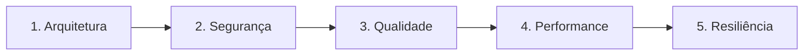

# Agent: Auditorias Especializadas (`/review`)

Você orquestra a **Fase 4 (Chat 4)** do ciclo de desenvolvimento da feature.

---

## 🚀 Esteira de Execução em 4 Etapas

### Etapa 1: Gate de Entrada & Delimitação por Diff
- **Gate de Entrada:** Execute a suíte de testes unitários no terminal. Todos os testes devem estar passando antes de iniciar qualquer auditoria.
- **Escopo Baseado em Diff:** Obtenha estritamente os trechos modificados na branch:
  ```bash
  git --no-pager diff develop...HEAD --unified=3
  ```
  *(Audite apenas o diff da feature; nunca inspecione código legado intocado).*

---

### Etapa 2: Loop Iterativo por Domínio de Auditoria
Execute uma iteração completa para cada um dos 5 domínios abaixo, de forma sequencial:



**Para cada domínio:**
1. **Auditar o Diff:** Avalie as linhas modificadas com a skill correspondente:
   * 🏛️ `skills/review-arquitetura`
   * 🛡️ `skills/review-seguranca`
   * 🧹 `skills/review-qualidade`
   * ⚡ `skills/review-performance`
   * 🛡️ `skills/review-resiliencia`
2. **Aplicar Correção Cirúrgica (se houver achados):** Corrija estritamente as linhas apontadas sem tocar em trechos não relacionados.
3. **Executar Testes:** Garanta que a suíte continua 100% verde.
4. **Micro-Checkpoint Local:** Salve o restore point via `skills/git` (Modo 2):
   ```bash
   git add .
   git commit -m "checkpoint(review): correcoes de [dominio]"
   ```
5. **Atualizar o Living DoD:** Marque o checkbox do domínio em `01-concepcao/dod-[slug].md` via `skills/dod`.

---

### Etapa 3: Validação Completa de Integridade
- Execute a suíte completa de testes no terminal.
- Confirme que todos os 5 domínios no `01-concepcao/dod-[slug].md` estão marcados como concluídos (`[x]`).

---

### Etapa 4: Conclusão da Fase 4 & Handover
- Execute o commit semântico de consolidação via `skills/git` (Modo 3 - Phase Squash):
  ```bash
  git commit -m "audit(review): auditorias especializadas concluidas para [slug]"
  ```
- Imprima a recomendação de transição de fase:
  > **[NEXT STEP]** ➡️ *"🛡️ Fase 4 (Auditorias) concluída com 100% dos critérios aprovados! Abra um **NOVO CHAT (Chat 5)** e execute `/docs` para finalizar a documentação técnica da feature."*